# Creating diagrams in draw.io for Terraform deployments based on the Yandex Cloud example

## Contents

* [Key terms and definitions](#terms)
* [What it is good for](#target)
* [Steps to follow](#process)
* [Hands-on example: Deploying a VM in Yandex Cloud](#ex):
  1. [Downloading a deployment example from its GitHub repository](#ex-1)
  1. [Preparing your Terraform deployment](#ex-2)
  1. [Preparing your Terraform data for a visual template (`drawio.tf`)](#ex-3)
  1. [Preparing (drawing) a visual parameterized template for your deployment in draw.io](#ex-4)
  1. [Integrating your Terraform deployment with the draw.io visual template](#ex-5)
  1. [Running Terraform deployment](#ex-6)
  1. [Getting the result as a visual representation of your deployment in `.drawio` format](#ex-7)
  1. [Verifying that the object attributes in the visual template are operable (optional step)](#ex-8)

## Key terms and definitions <a id="terms"/></a>

* [draw.io](https://app.diagrams.net/): Tool to draw diagrams.
* Terraform deployment: Collection of `.tf` files to define the target state of the system to deploy.
* Object attributes: Description of variables for the respective objects in the [variables.tf](./variables.tf) file.
* Visual representation of the deployment, or visual template: Parameterized diagram in `.drawio` format. Parameterization here means creating special attributes (variables) for draw.io shapes.

## What it is good for <a id="target"/></a>

Currently, the best-known infrastructure as a code (IaC) tool is [Terraform](https://terraform.io).

Standard Terraform deployment usually consists of a number of `.tf` files, each describing a specific part of the target state for your system. Here are some examples:
  * [providers.tf](./providers.tf): TF providers to use and their parameters.
  * [variables.tf](./variables.tf): Description of input variables for the deployment.
  * [compute.tf](./compute.tf): Description of the Compute resources.
  * `vpc.tf`: Description of the network resources.

The extent and structure of how you allocate TF resources across different files varies from project to project, there is no silver bullet. You can describe your entire project in one single large `.tf` file, such as `main.tf`; however, managing such large deployments is likely to be difficult.

What Terraform deployment does is create resources (objects) in your infrastructure. Use Terraform CLI to view the list of created resources and evaluate their status (`Terraform state`); however, Terraform lacks native tools to visually display the structure of created resources.

Basically, Terraform deployments are static, i.e., the `terraform apply` command always creates a strictly defined set of objects. Two different deployments of the same type are likely to differ only in the values of the created object attributes, i.e., the respective variable values in the [variables.tf](./variables.tf) file. 

If you need a visual representation of an object structure where the structure is always the same and objects differ in values of their attributes (parameters), you will benefit from using a generalized template. That template should cover all elements of the deployment structure of a given type (resources and links between them). Once you have one, simply provide the attribute values for variables that define a particular deployment. Many well-known templaters in programming languages, such as [Jinja](https://jinja.palletsprojects.com/) or [Go Template](https://pkg.go.dev/text/template), work this way.

For the visual template in this example, the values of attributes (variables) are provided from the [variables.tf](./variables.tf) file. When the deployment (by `terraform apply`) is complete, a `.drawio` diagram for that completed deployment will be generated with the attribute values that were set in `variables.tf`.

## Steps to follow <a id="process"/></a>

To create a visual representation of a TF deployment as described above, follow these steps:
  1. Prepare a Terraform deployment (a set of `.tf` files). Remember to parameterize all the relevant attributes of TF resources in `variables.tf`.
  1. Prepare your Terraform data for a visual template.
  1. Prepare (draw) a visual parameterized template for your deployment, in draw.io.
  1. Integrate your Terraform deployment with the draw.io visual template.
  1. Perform your Terraform deployment.
  1. Get the result which is a visual representation of your deployment, in `.drawio` format.

## Hands-on example: deploying a VM in Yandex Cloud <a id="ex"/></a>

Let's see how the above approach works, As an example, we will be creating a virtual machine (VM) in Yandex Cloud.

Here is the list of attributes (variables) to use during the deployment:
  * `cloud_id`: ID of the cloud to create the VM in.
  * `folder_id`: ID of the folder to create the VM in.
  * `image_family`: Image family to create the VM from.
  * `net_name`: ID of the cloud network to create the VM in.
  * `subnet_name`: ID of the cloud subnet to create the VM in.

Here is the list of attributes to use once the deployment is completed:
  * `vm_priv_ip`: Private IP address to assign to the VM when creating it.
  * `vm_pub_ip`: Public IP address to assign to the VM when creating it.

We assume that all resources, i.e., `net`, `subnet`, and `image`, were created before starting this deployment.

### Download a deployment example from this GitHub repository <a id="ex-1"/></a>
  ```bash
  curl -s https://raw.githubusercontent.com/yandex-cloud/yc-architect-solution-library/master/drawio-tf-tutorial/install.sh | bash
  ```

### Prepare your Terraform deployment <a id="ex-2"/></a>
  * [variables.tf](./variables.tf)
  * [providers.tf](./providers.tf)
  * [compute.tf](./compute.tf)

Initialize Terraform and verify that the deployment has no errors:

```bash
cd drawio-tf-example
source env-yc.sh
terraform init
terraform plan
```

### Prepare your Terraform data for a visual template (`drawio.tf`) <a id="ex-3"/></a>

To use object attributes in a visual template, you must first prepare them in Terraform. To do this, use Terraform [locals](https://developer.hashicorp.com/terraform/language/values/locals).

The TF deployment create a special file named [drawio.tf](./drawio.tf) that describes a set of attributes (parameters) whose values will be provided to the visual template. Here you match the attribute name with its actual value from the TF deployment.

When executing the TF code, the following parameters are provided to `drawio.tf`: 
  * Name of the file containing a visual template of your deployment, i.e., the `draw_template_name` variable value. 
  * Name of the file to save the TF-generated deployment diagram (in `.drawio` format), i.e., the `draw_name` variable value.

After that, the `TF_DRAW_DATA` variable on the TF side collects all data required for the visual template.

All the above parameters are fed on the Terraform side to the [templatefile](https://developer.hashicorp.com/terraform/language/functions/templatefile) function, which inserts the prepared data from `TF_RAW_DATA` into the prepared visual template.

You only need to specify the place on the diagram where you want to use this or that attribute. For more information, see [Section 5](#ex-5).

### Prepare (draw) a visual parameterized template for your deployment in draw.io <a id="ex-4"/></a>

Go to [draw.io](https://app.diagrams.net) and click **Create New Diagram**.

<p align="left">
    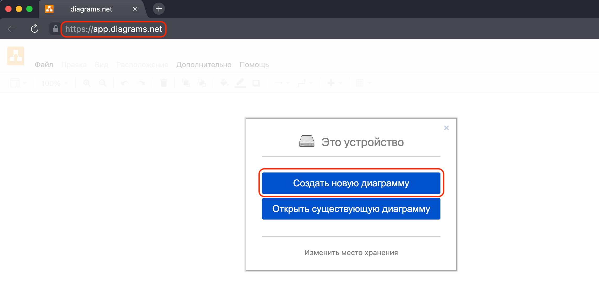
</p>

You also can download the offline version of `Draw.io` for the relevant platform to your PC using [this link](https://github.com/jgraph/drawio-desktop/releases).

Set the file name for the diagram, specify `XML` as its type, and click **Save**.

<p align="left">
    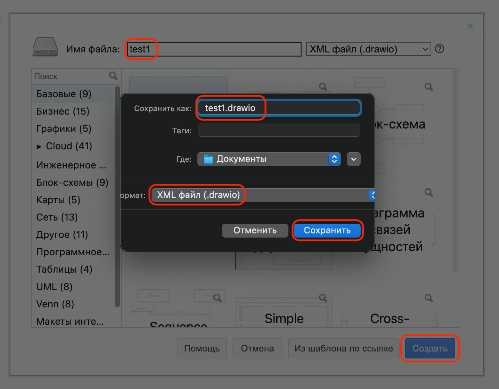
</p>

In the menu, select **File → Properties...**.

<p align="left">
    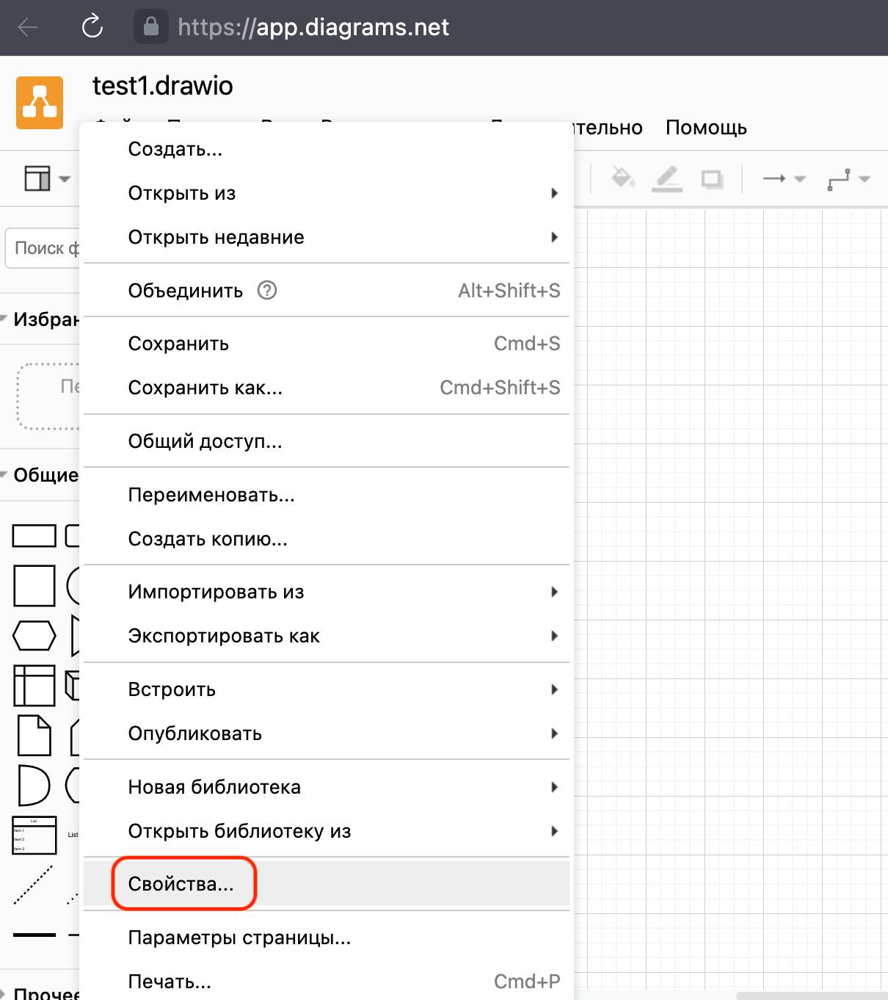
</p>

In the box that opens, untick the **Compressed** checkbox and click **Apply**. This will instruct draw.io to save files in plain text (XML) form without using ZIP compression.

<p align="left">
    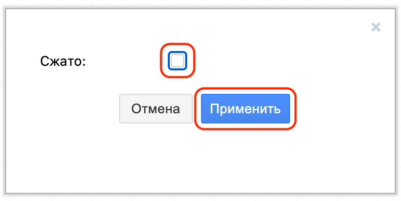
</p>

Draw the diagram you need with geometric primitives. In the example below, we draw a rounded rectangle that represents the cloud in Yandex Cloud.

To add attribute (parameter) values for a cloud to the diagram, expand the **+** drop-down menu in the top menu bar and select **Text**.

<p align="left">
    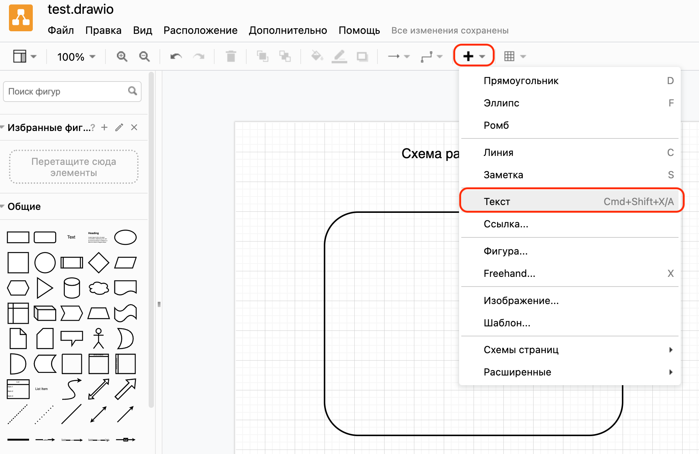
</p>

In the diagram area, the blue dotted line will highlight the area containing the `Text` value for you to enter the text. You can enter the object attribute text in the following format: `[Label] <%variable-name%>`, where: 
  * `Label`: Any text to explain the variable. Labels are optional, so you can skip them.
  * `%variable-name%`: Name of the variable defined in the `locals` construct of the [drawio.tf](./drawio.tf) file. Always border the variable name on both sides by the `%` character.

In the example below, the `cloud = ` text is the label and the text between the percent characters, i.e. `cloud_id`, is the variable name:

<p align="left">
    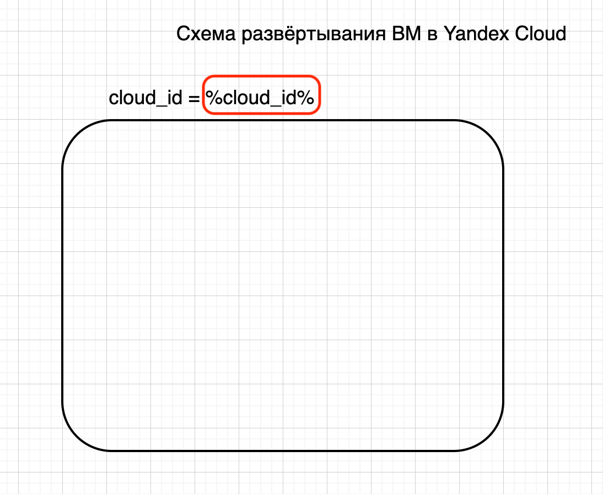
</p>

Right-click the object with the previously entered text (`cloud id = %cloud_id%`). In the context menu that opens, select **Edit Data...**. You can also use the `Cmd+M/Ctrl+M` shortcut to quickly switch to this mode.

<p align="left">
    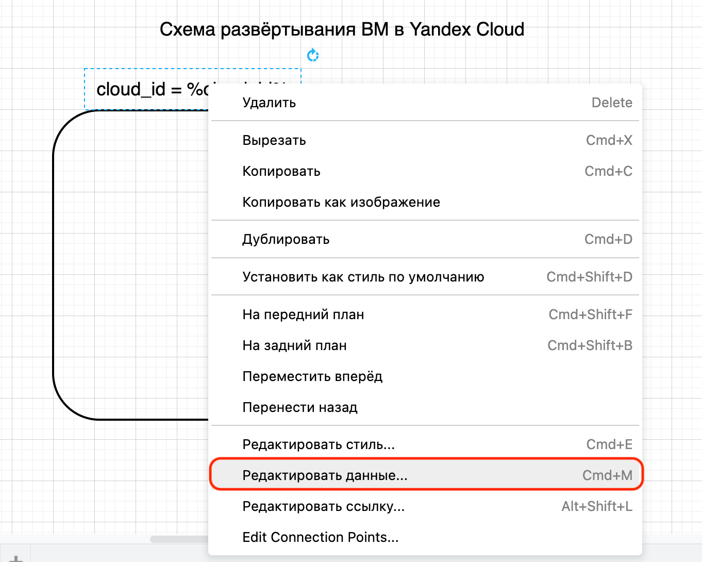
</p>

In the box that opens, check the **Placeholders** option at the bottom and click **Apply**.

<p align="left">
    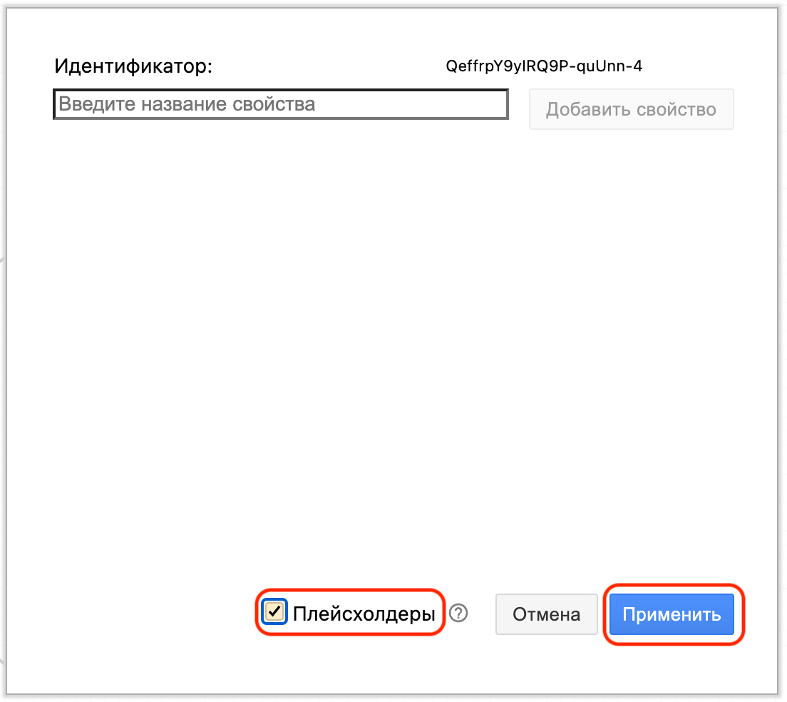
</p>

As a result, a cloud object with the `cloud_id` attribute may look like this:

<p align="left">
    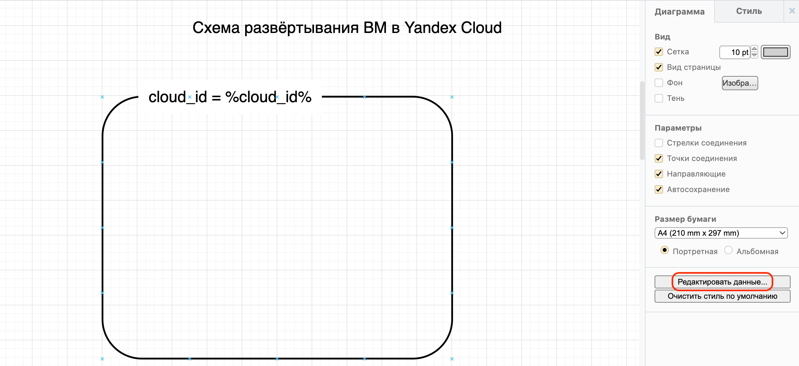
</p>

Let's continue drawing the visual structure of your Terraform deployment in the diagram. Now, it is time to add new object attributes. You should always add object attributes at the level of the drawing sheet area rather than at the level of an individual object on the sheet. This allows draw.io to store the attributes of all objects in one place. The result of drawing may look like this:

<p align="left">
    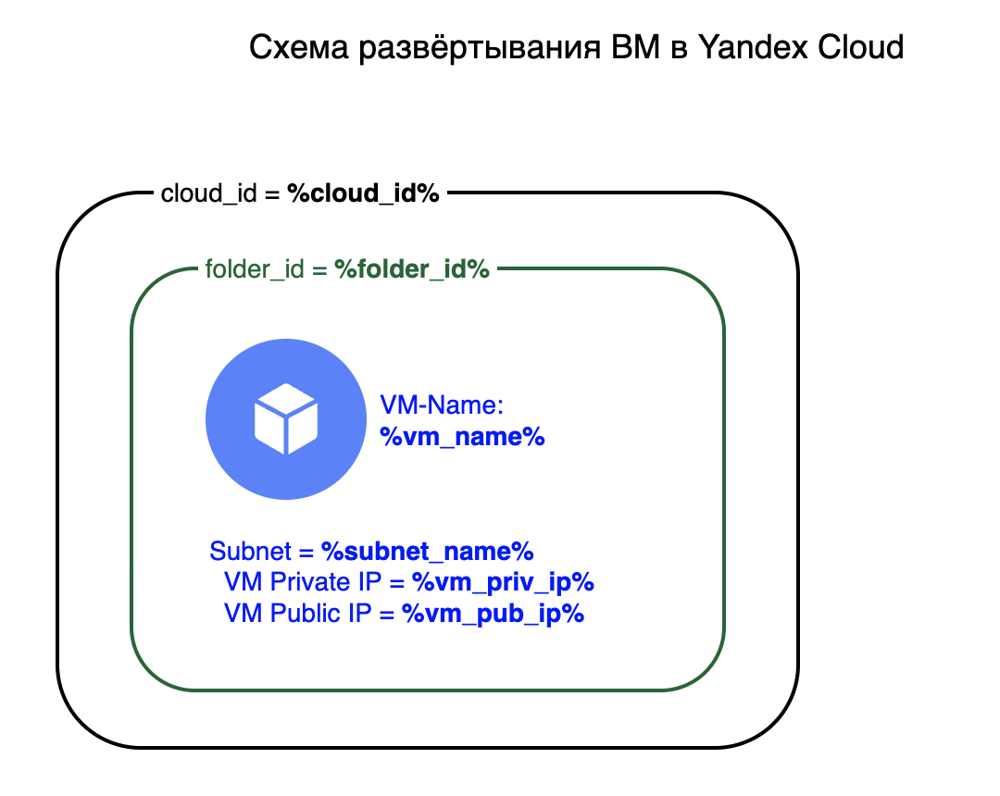
</p>

This diagram shows the following objects and their attributes:
  * `Cloud` with the `cloud_id` attribute.
  * `Folder` with the `folder_id` attribute.
  * `VM` with the following attributes: 
    - `vm_name`: VM name.
    - `subnet_name`: Name of the subnet the created VM will connect to.
    - `vm_priv_name`: Private IP address that will be assigned to the created VM.
    - `vm_pub_name`: Public IP address that will be assigned to the created VM.

### Integrate your Terraform deployment with the draw.io visual template <a id="ex-5"/></a>

Once you created a visual template, you need to integrate it with Terraform deployment. To do this, add a reference to the `TF_RAW_DATA` variable in the appropriate place in the template's XML file.

To make changes, you need to open the template file in any text editor and run search and replace as follows:
  * Find the `<object label="" id="0">` line.
  * Replace it with `<object label="" ${TF_DRAW_DATA} id="0">`.

Your template file before the replacement:
<p align="left">
    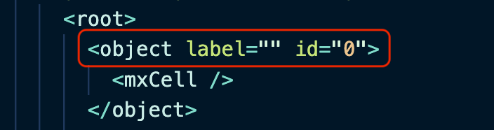
</p>

Your template file after the replacement:
<p align="left">
    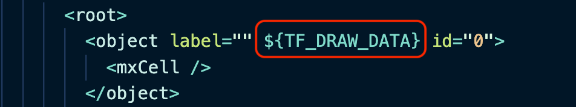
</p>

After making changes to the visual template file, you will no longer be able to open it directly in draw.io; this is why you may want to change the extension of the file from `.drawio` to `.tpl`.

#### Editing a template file in draw.io

In case you need to edit the template file in draw.io in the future, make sure to accordingly prepare it beforehand. Open the relevant `.tpl` file in any text editor, delete the `${TF_DRAW_DATA}` line in it, and then save the changes. After that, the template file will open normally (without errors) in draw.io. Before you can use an already modified template in Terraform deployment, you will need to put the `${TF_DRAW_DATA}` line back into the file.

### Perform your Terraform deployment <a id="ex-6"/></a>

```bash
source env-yc.sh
terraform apply
```

### Get the result which is visual representation of your deployment in `.drawio` format <a id="ex-7"/></a>

Let’s assume your diagram looks as follows:

<p align="left">
    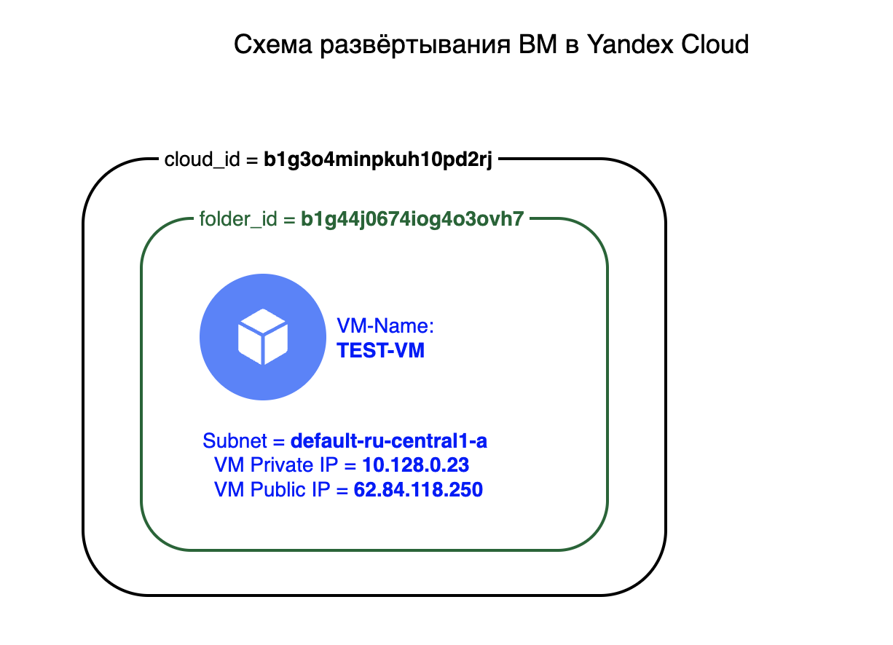
</p>

To view the attributes nested in the diagram, switch to the **Edit Data...** mode through the menu or keyboard shortcuts.

<p align="left">
    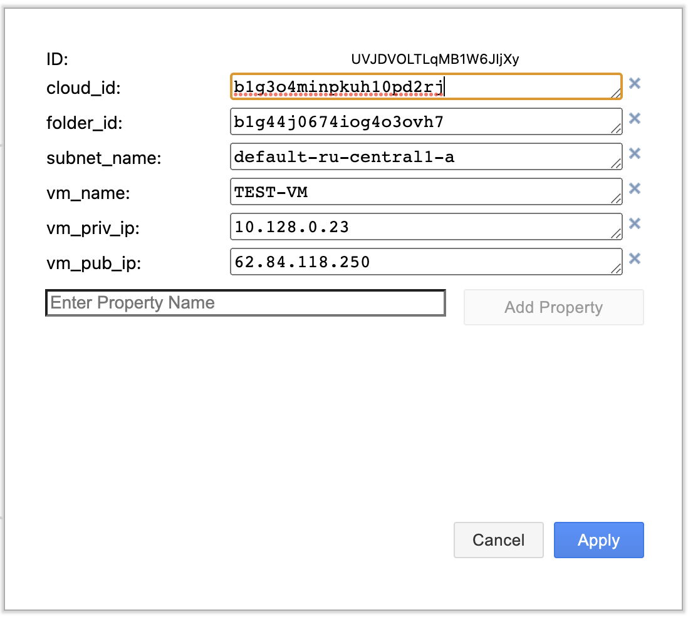
</p>

For locally installed draw.io, you can convert your diagram from `.drawio` format to others, such as:
  * PDF: `draw --export --format pdf test-vm.drawio`
  * PNG: `draw --export --format png test-vm.drawio`

When using [draw.io online](https://app.diagrams.net/), you can export your diagram by selecting **File → Export as** in the main menu.

### Optional step: Verify that the object attributes in the visual template work correctly<a id="ex-8"/></a>

You can verify that the object attributes you created in the visual template work correctly.

To do this, go to the drawing sheet area, point you mouse to any free area on the drawing sheet, and switch to the **Edit Data...** mode via the menu or keyboard shortcuts.

In the input box that opens, enter the name of the attribute (variable) and click **Add Property**.

<p align="left">
    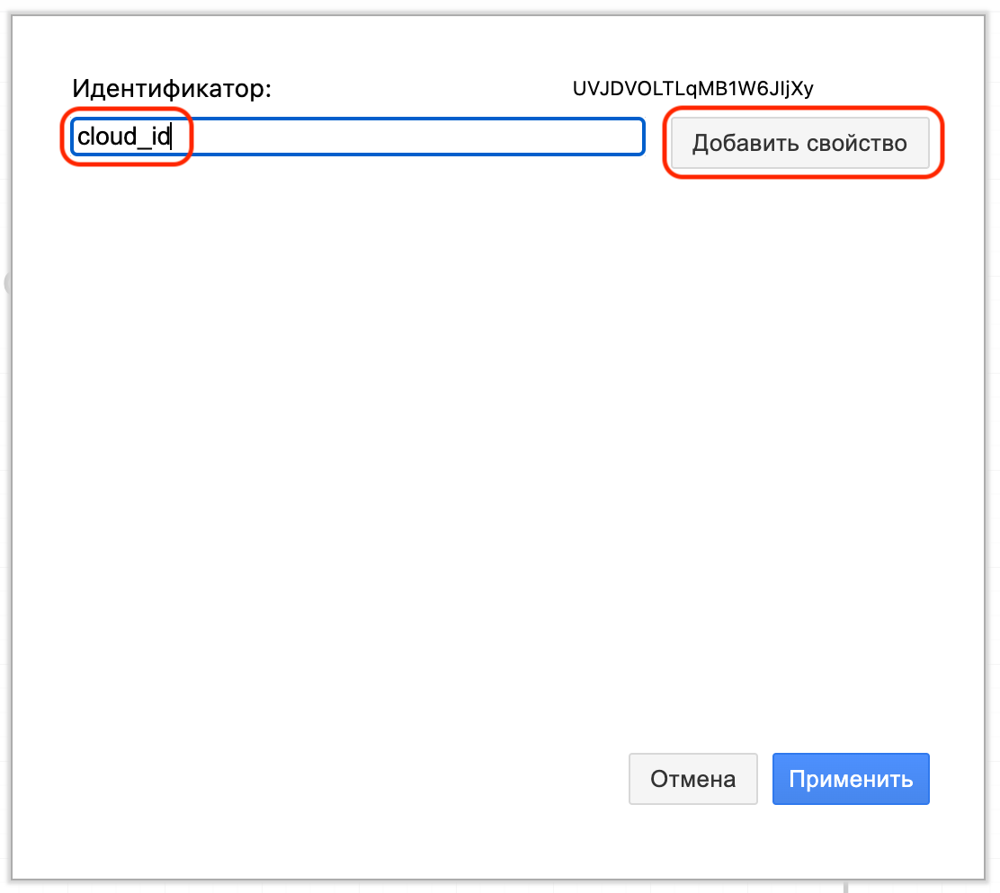
</p>

Set the value for the attribute and click **Apply**.

<p align="left">
    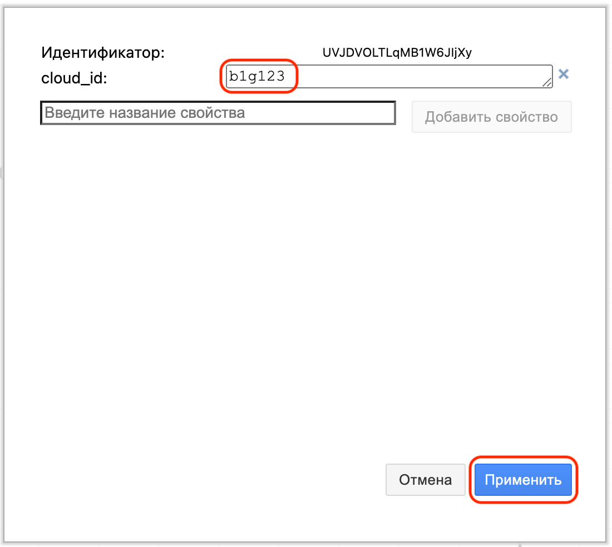
</p>

The result may look as follows:

<p align="left">
    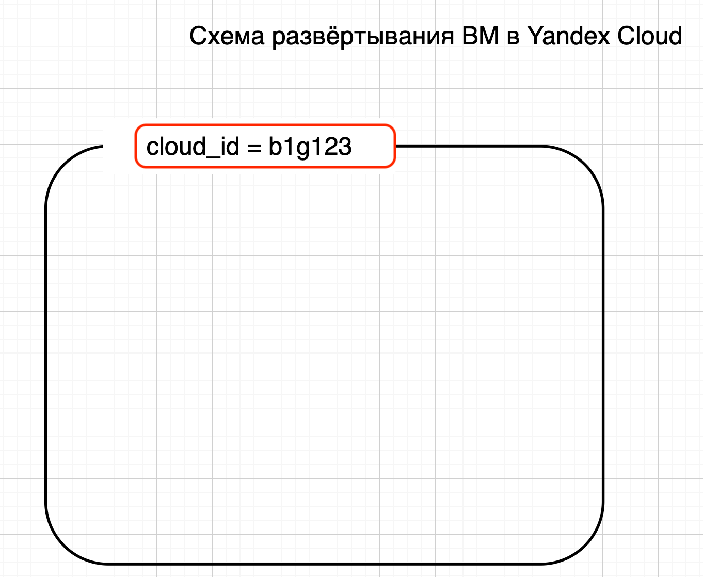
</p>

To delete an attribute, click the crosshair icon to the right of the attribute value input field, and then click **Apply**.

<p align="left">
    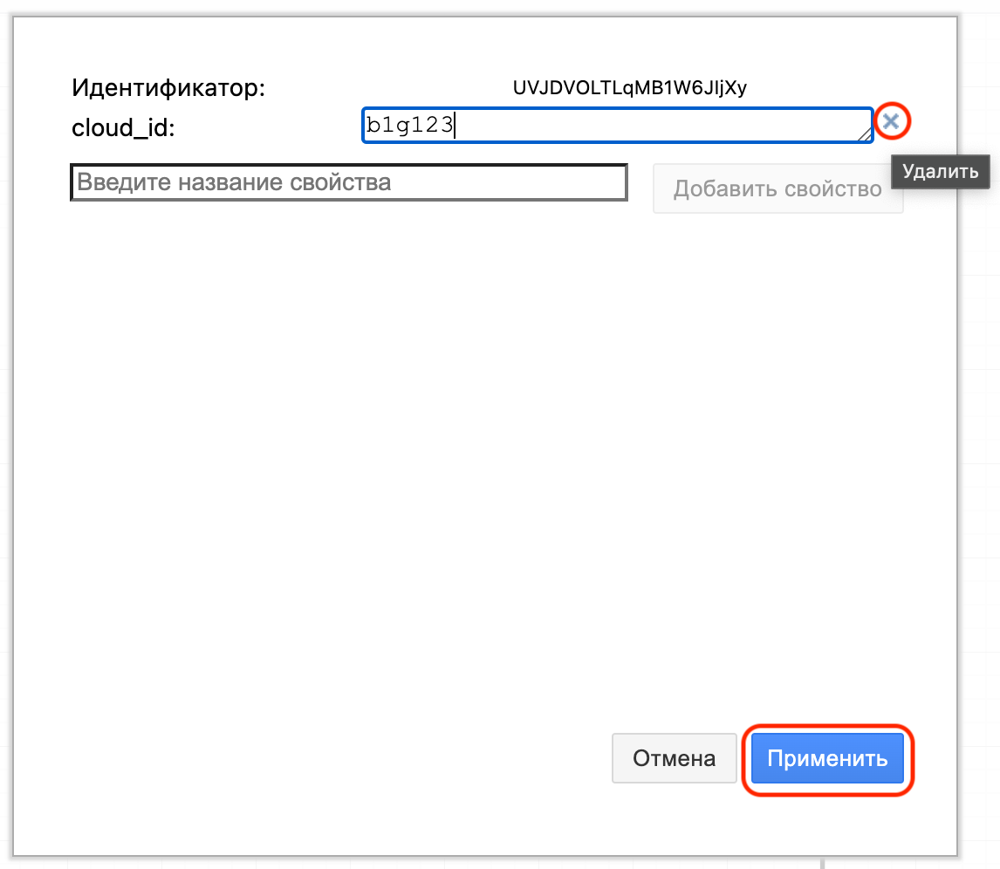
</p>
